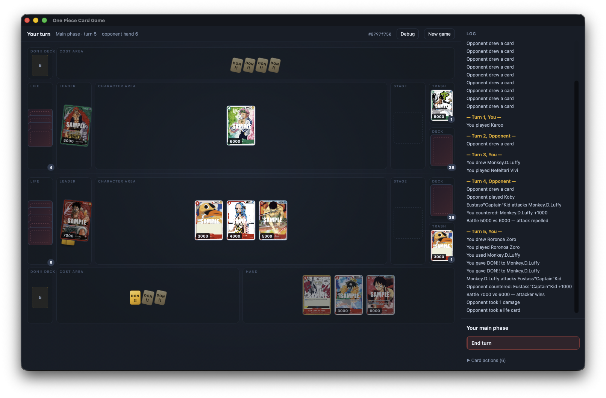

# OnePieceSim

[](LICENSE)
[](#coverage-of-the-source)

<p align="center">
  
</p>

<p align="center">
  <em>The desktop client on turn 5 — both boards, the hand, and the turn log.
  Card art is fetched at runtime and is not part of this repository.</em>
</p>

> Unofficial fan project. Not affiliated with or endorsed by Bandai, Toei
> Animation, Shueisha, or Eiichiro Oda. Source code is AGPL-3.0; third-party
> names, trademarks, card data and artwork remain the property of their
> respective owners and are **not** licensed under the AGPL. See [NOTICE](NOTICE).

A deterministic, event-driven rules engine for the **One Piece Card Game**
(Bandai OPTCG), built to serve three consumers off one kernel: local play against
an AI, a reinforcement-learning sandbox, and online multiplayer.

Rules are implemented against the official **Comprehensive Rules v1.2.0**
(2026-01-16). Non-obvious code carries the rule number it comes from, and the
test suite is named for the clauses it pins down.

## Install

Download the file for your platform from
[Releases](https://github.com/mcsantiago/rusty-d-luffy/releases/latest).

| Platform | File |
|---|---|
| macOS (Intel and Apple Silicon) | `OnePieceSim_<version>_universal.dmg` |
| Windows | `OnePieceSim_<version>_x64-setup.exe` |
| Linux | `OnePieceSim_<version>_amd64.AppImage`, or the `.deb` / `.rpm` |

**The builds are unsigned, so your OS will warn you the first time.** Signing
certificates cost money this project does not have. The warning means "nobody
paid Apple or Microsoft to vouch for this", not that anything is wrong with the
download — but you are right to be careful with unsigned software from
strangers, so build from source if you would rather not take that on trust.

<details>
<summary><b>macOS</b> — "cannot be opened because the developer cannot be verified"</summary>

Open the `.dmg` and drag the app to Applications. Then, the first time only:

1. **Right-click** (or Control-click) the app in Applications and choose **Open**.
2. Click **Open** in the dialog that appears.

Double-clicking will not offer that choice — only the right-click route does. If
macOS says the app "is damaged and can't be opened", it was quarantined on
download; clear the flag with:

```bash
xattr -dr com.apple.quarantine /Applications/OnePieceSim.app
```
</details>

<details>
<summary><b>Windows</b> — "Windows protected your PC"</summary>

Run the installer. When SmartScreen appears:

1. Click **More info**.
2. Click **Run anyway**.

If your browser blocks the download itself, choose **Keep** from the downloads
list first.
</details>

<details>
<summary><b>Linux</b></summary>

The AppImage needs the executable bit:

```bash
chmod +x OnePieceSim_*_amd64.AppImage
./OnePieceSim_*_amd64.AppImage
```

Or install the `.deb` (`sudo apt install ./OnePieceSim_*_amd64.deb`) or `.rpm`.
</details>

### First run downloads the cards

The app ships with **no card data**. Card text and art are Bandai's copyright
and are not redistributed here, so the first launch fetches them — all 59 sets,
around **750 MB**, which takes a few minutes on a decent connection.

The window opens immediately and shows progress; only *Start game* waits. After
that the app is entirely offline, and a re-install skips the fetch if the data
is already on disk. An interrupted download resumes rather than restarting.

## Build from source

Rust 1.88 or newer. No other toolchain — the card fetch is Rust, not Python.

```bash
# Either client fetches card data on first run. No setup, no Python.
cargo run -p op-desktop --release

cargo run -p op-cli --release -- --help
cargo run -p op-cli --release            # you (ST-01) vs AI (ST-02)
cargo run -p op-cli --release -- --hard --second
cargo run -p op-cli --release -- --autoplay --seed 7   # watch the AI play itself

# 3. Verify
cargo test
cargo run -p op-cards --bin coverage     # which cards have scripts
```

## Layout

| Crate | What it is |
|---|---|
| `op-core` | The kernel: zones, state, turn and battle machines, effect resolution, derived characteristics, legal-action generation, per-player views |
| `op-cards` | Card scripts, one module per product, plus the scripting DSL |
| `op-ai` | Determinization, a heuristic evaluation/agent, and ISMCTS |
| `op-cli` | Terminal client |
| `op-desktop` | Tauri desktop client; `client/` holds the front end |
| `op-ingest` | Fetches card data and art |
| `tools/ingest` | The same fetch as a standalone Python script, for scripting |

## Design

**Determinism.** A game is a pure function of `(GameConfig, seed, [Action])`.
All randomness runs through one seeded `ChaCha8Rng`; rules paths use ordered
containers and dense integer ids only; there is no floating point in the rules.
A replay is a seed plus an action list.

**Effect resolution suspends as data.** The ruleset has no MTG-style stack —
effects resolve immediately, turn player first (8-6-1) — but they routinely stop
mid-way to ask a player something: choose a target (8-4-4), activate a
`[Trigger]` in the middle of damage (8-6-2-1), pay a cost (8-4-1-3). That
suspension is an instruction pointer in a plain-data `EffectFrame`, not a
coroutine, so `GameState` stays `Clone + Serialize` even mid-effect. MCTS
cloning, server snapshots, and save/replay all depend on that.

**Characteristics are derived, never stored.** Power, cost and keywords are
recomputed from printed values plus DON!! attachment plus modifiers plus
permanent effects, the last applied in the fixpoint loop of 8-1-3-3-5. This is
the one decision that cannot be retrofitted.

**Hidden information is a type boundary.** `GameState` is omniscient and never
leaves the server; clients and imperfect-information agents get `PlayerView`.
Agents that must not cheat destroy what they cannot see via
`op_ai::determinize`, which reshuffles hidden cards among the hidden slots they
could occupy.

**One legal-action generator.** `op_core::legal_actions` is the move generator
for search, the RL action mask, and the server's validator — so the three cannot
disagree about what is legal.

## Desktop client

Tauri rather than Electron because the engine is already Rust: `op-core` links
straight into the app binary, so a UI click calls `Game::step` in-process. No
sidecar, no hand-written IPC protocol, no bundled Chromium. The front end under
`client/` is plain ES modules — there is no JavaScript build step.

The UI is a **renderer**. It is handed a `PlayerView`, a log of already-projected
`PlayerEvent`s, and the legal actions for the human seat — never `GameState`.
That is the same boundary the multiplayer server will use, so this front end
should survive the transport becoming a socket.

**First run fetches its own data.** `data/` is empty on a fresh clone — the card
text and art are Bandai's copyright and are not vendored — so the window opens
first and `op-ingest` fetches on a worker thread, streaming progress into the
setup panel. Only *Start game* is gated while that runs; the window stays live.

The fetch is Rust, not a subprocess: a shipped binary cannot require `python3`,
which is absent by default on Windows and where the name often resolves to a
Store stub that opens the Store rather than running anything.

Data lives in the platform's per-user application data directory — never the
install directory, which is not user-writable on Windows or macOS. A checkout's
`data/` wins when present, so development keeps using the working copy;
`OPSIM_DATA_DIR` overrides both.

Everything is fetched up front, the way a phone TCG client does it: all 59
sets, ~2,700 files. The size and the wait are covered under
[Install](#install); what matters here is that it is one fetch, not a
per-session one.

Two things make that survivable. The fetch **skips what is already on disk**, so
an interrupted run resumes instead of restarting. And startup checks for missing
*art*, not just missing card data — an interrupted run leaves cards complete and
art partial, and checking only for card JSON would call that finished.

*Start game* stays disabled until the download completes. Art arrives across all
59 sets in no particular order, so a game started early would render text
placeholders rather than the cards in your own deck. A complete install skips
the fetch entirely and opens offline.

Card art is served as data URIs. Without it the UI falls back to drawing text
cards, so the app still runs.

> `client/` is embedded into the binary at compile time, so **editing the front
> end requires `cargo build -p op-desktop`** — a browser refresh will not pick
> changes up.

## Debug logs

Every session writes `debug/session-<time>-<seed>.jsonl` (gitignored). JSON
Lines, flushed per step, so a log from a run that crashed still has its tail.

Because a game is a pure function of `(config, seed, [Action])`, the log is a
**reproducer** rather than a trace: the header carries the config and both
decklists in order, and each step carries the action, the resulting `GameEvent`s,
and the state hash. Replay it:

```bash
cargo run -p op-cli --bin op-replay -- debug/session-*.jsonl
```

That rebuilds the game from the header alone, steps the recorded actions back
through the engine, and checks the events and the state hash at each one. It
reports the *first* step that differs, with the action and the cards it names,
and exits non-zero — so a log kept from an earlier build is a regression test,
and a rules change that moves a position tells you which step it moved.

The log is **omniscient**: it records `GameEvent`, not `PlayerEvent`, so it
contains both hands. That is what makes it useful for diagnosing the engine, and
why it must never be surfaced to a player mid-game — the replay tool is local,
and belongs nowhere near a client.

`OPSIM_DEBUG_DIR=` disables logging; any other value overrides the directory.
`--log <DIR>` does the same for one terminal session.

## Card data

Fetched from [`buhbbl/punk-records`](https://github.com/buhbbl/punk-records)
(static JSON generated by [`Coko7/vegapull`](https://github.com/Coko7/vegapull)
from Bandai's official site). Card text and images are Bandai's copyright;
nothing is vendored into this repo or its binaries.

The upstream revision is **pinned to a commit** (`op_ingest::SOURCE_REF`), not a
branch. A released binary tracking `main` would change behaviour whenever a
third party edited their repository, and break outright if it were renamed —
with no recourse for anyone who had already installed. The cost is that new
sets need a deliberate bump: pick a commit, update the constant, re-run the
tests. `OPSIM_SOURCE_REF` overrides it for trying a newer revision without a
rebuild.

```bash
python3 tools/ingest/fetch_cards.py                   # ST-01 and ST-02
python3 tools/ingest/fetch_cards.py --packs OP-01 EB-04 PROMO
python3 tools/ingest/fetch_cards.py --all             # 2,665 cards, ~1s
python3 tools/ingest/fetch_cards.py --list            # available pack names
```

Names are matched case- and dash-insensitively, so `OP-01`, `op01` and `OP 01`
are the same pack. Already-fetched packs are skipped, so an interrupted run
resumes; `--refresh` forces a re-download and `--jobs 1` serialises if a network
objects.

One request per product, from upstream's `english/data/<pack_id>.json`
aggregates. The GitHub API is not used at all, so the 60-requests-per-hour
unauthenticated limit never applies.

### Upstream quirks the ingest handles

- **A Leader's Life value is stored in the `cost` field.** Mapped in
  `card.rs`; pinned by a test against real data.
- **"No rules text" is a literal `"-"`,** not null or an empty string — 317
  cards across the pool. Normalised to `None` in `card.rs`, so vanilla cards
  aren't mistaken for unimplemented ones.
- **Alternate printings get their own ids** — `OP01-016_p1` (parallel),
  `EB01-006_r1`. They are the *same card*, including for the four-copy deck
  limit (5-1-2-3), so registering them separately would let a deck field eight.
  They are skipped on fetch and dropped again at load
  (`op_core::card::is_art_variant`); every variant has a base card, so this is
  lossless. Of upstream's 4,672 entries, **2,665 are distinct cards** and 2,007
  are alternate art.
- **Not every product code appears as a label.** OP-14 and OP-15 ship as
  combined products labelled `OP14-EB04` / `OP15-EB04`, and the promo and
  "Other Product" packs carry no label at all. The ingest registers each
  component as an alias, so `--packs OP-14` and `--packs PROMO` resolve;
  `EB-04` correctly resolves to both boosters that carry it.

### Coverage of the source

Complete, with no gaps in card numbering, for **OP-01 → OP-16, EB-01 → EB-04,
ST-01 → ST-36**. Two known holes: promos are partial (~105 of ~155 `P-xxx`
numbers), and `PRB-01` has a single entry. Neither affects the starter-deck
pool this project currently scripts.

Card *scripts* — our encoding of what each card does — are compiled in and keyed
by card number.

A card with no script plays as a vanilla body, which is correct for the many
cards with no text. The coverage report separates the two:

```bash
cargo run -p op-cards --bin coverage          # one line per set
cargo run -p op-cards --bin coverage -- EB01  # what EB01 still needs, with text
```

## Adding a set

1. `python3 tools/ingest/fetch_cards.py --packs OP-01`
2. `cargo run -p op-cards --bin coverage -- OP01` to list what needs scripting
3. Add `crates/op-cards/src/sets/op01.rs`, register it in `sets/mod.rs` and
   `all_scripts()`, until the set reports `OK`
4. Extend the DSL vocabulary in `op-cards/src/dsl.rs` (and the ops in
   `op-core/src/effect.rs`) where existing pieces do not fit
5. Bump the card-sets badge and the `Status` line at the top of this README —
   `cargo run -p op-cards --bin coverage` prints the `N/59` to put in both

## Status

**v0.3.0** — two more starter decks, ST-04 Animal Kingdom Pirates and ST-08
Monkey D. Luffy, taking card coverage to 5 of 59 sets. A rules fix worth
naming: an effect whose cost reads "you may" is now yours to decline (8-3-1-4),
where the engine used to pay it for you — which could spend DON!! permanently
on an effect that then did nothing. Session logs record the engine that wrote
them, so a replay divergence tells you whether the rules changed or something
broke. Playable against the AI on macOS, Windows and Linux — see
[Install](#install) for the unsigned-binary warnings and the first-run fetch.

Implemented: the rules kernel, ST-01, ST-02, ST-04, ST-06 and ST-08 at full
script coverage, the legal-action generator, heuristic and ISMCTS agents, static
validation of card scripts, session replay and verification, and both clients —
desktop and terminal.

Not yet built: PyO3 bindings and the Gymnasium environment, and the authoritative
multiplayer server and web client. Both sit on top of the existing kernel: the
ruleset is turn-based and deterministic, so the server needs no rollback or
prediction — it steps recorded actions and projects the result. That
determinism does not make peers interchangeable with a server, though. Lockstep
would keep two peers synchronised while giving both of them the whole shuffle,
and hidden information is the reason this needs an authority at all. The design
is in [docs/multiplayer.md](docs/multiplayer.md).

### Known simplifications

These are deliberate and localised; each is commented at its site.

- `DigTop` returns unchosen cards to the bottom of the deck in draw order; the
  card text permits any order, but the ordering is unobservable and enumerating
  permutations would inflate the action space for search and RL.
- An auto effect's hand cost takes the leftmost cards rather than asking which.
  Whether to pay at all is now a real choice (8-3-1-4), which is the half that
  was spending resources nobody agreed to spend; picking *which* card wants a
  second decision point and is not built. Affects ST04-008, ST06-002 and
  ST08-005.
- An unscripted `[Trigger]` is treated as absent rather than offering a choice
  that would do nothing.
- An Event whose `[Main]` text names a further cost ("You may … : …") pays it
  whenever it can. Declining would resolve nothing for DON!! already spent, so
  it is never a choice worth offering; playing the Event is the decision.
  ST08-014 is the only card affected.
- ST08-013 pays its own K.O. for a trade whose K.O. an effect could in
  principle prevent. No card in the implemented pool can produce that board.
- ST04-001 trashes the *top* of the opponent's Life rather than offering a pick.
  Life is a secret area (3-1-4): the cards are face down and indistinguishable,
  so the choice decides nothing, and enumerating it would leak their ids.

## Contributing

See [CONTRIBUTING.md](CONTRIBUTING.md) for the policy — including that AI
assistance is welcome and needn't be declared — and [AGENTS.md](AGENTS.md) for
how the codebase is organised and which invariants are easy to break.

## Licence

Source code is licensed under [AGPL-3.0](LICENSE). AGPL rather than a
permissive licence because of the multiplayer plan: it is the one copyleft that
reaches *network* use, so a hosted server running a modified build has to
publish those modifications. Hosting is not distribution, and GPL would not
cover it.

The licence covers this source and nothing else — see [NOTICE](NOTICE) for what
that excludes and why it matters here.
